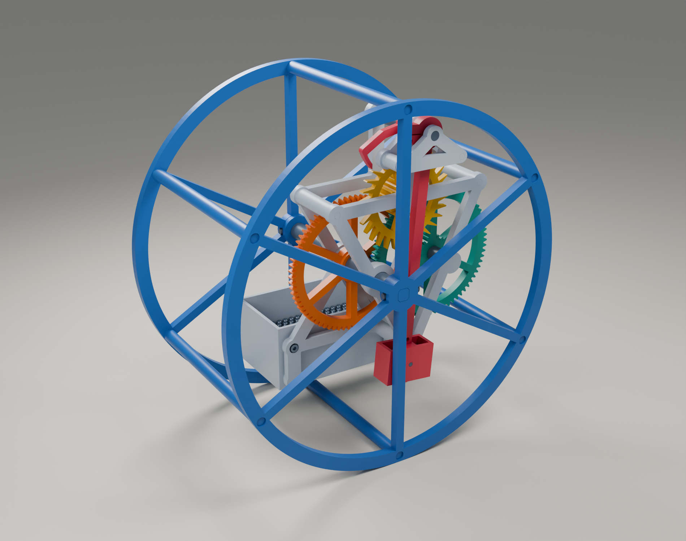
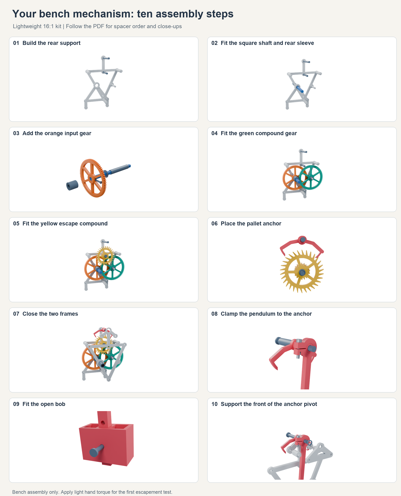

# Rolling clock

A 3D-printed clock mechanism powered by its own slow roll down an incline. The rolling drum drives a pendulum escapement through two 72:18 gear pairs. A weighted inner frame carries the gears and stays approximately upright while the drum turns around it.

Designed by László Lukács with OpenAI Codex for a Bambu Lab P1S, using PLA, a 0.4 mm nozzle and 0.2 mm layers. Intended as a short-duration timer and mechanical demonstration.



## New prototype - bolted R3

The [R3 design](designs/rolling-timer-r3/README.md) responds to the first build's physical feedback: square screw-fastened posts, a screw-fixed bob, more pendulum space, a deeper rolling rim and shared frames for 16:1, 32:1 and 64:1 gearing. It includes [a new 13-page illustrated guide](designs/rolling-timer-r3/BUILD-GUIDE.pdf) and separate print lists. **R3 is CAD-checked but not yet physically tested.** The first working version remains below and under tag `v0.1.0`.

## Current state — first working build

On **1 October 2026**, the complete lightweight **16:1** mechanism ran on its first physical trial, following a successful hand-driven bench test. This repository preserves that design before the next round of improvements. Running duration, timing accuracy and long-term wear have not yet been measured.

The reported issue is occasional contact between the pendulum bob and the interior frame or drum spokes. A separate [1 mm wall replacement bob and shorter pin](designs/rolling-timer-p1s-light/bob-1mm/README.md) provide 1.4 mm more clearance on each side while preserving the iron capacity and rod fit. This replacement has passed geometric checks but **has not yet been physically tested**. The original working STL set is retained unchanged.

## Start here

1. Use the **[lightweight 16:1 design](designs/rolling-timer-p1s-light/README.md)** and its **[print list](designs/rolling-timer-p1s-light/PRINT-LIST.md)**. The list gives quantities and orientations; optional fit coupons are included.
2. Follow the **[illustrated bench assembly guide (PDF)](designs/rolling-timer-p1s-light/bench-guide/bench-assembly-guide.pdf)** for the gear train, escapement and pendulum. A [browser version](designs/rolling-timer-p1s-light/bench-guide/index.html) is included; download the repository and open it locally.
3. Follow the **[complete assembly instructions](designs/rolling-timer-p1s-light/ASSEMBLY.md)** to add the ballast cup and rolling drum.
4. For the clearance update, replace parts 25 and 26 with **[25_open_pendulum_bob_1mm.stl](designs/rolling-timer-p1s-light/bob-1mm/25_open_pendulum_bob_1mm.stl)** and **[26_bob_pin_short.stl](designs/rolling-timer-p1s-light/bob-1mm/26_bob_pin_short.stl)**. Follow that folder's fitting instructions; the guide's pictures show the original bob.

**Rotation direction:** viewed from the pendulum/front side, the orange input and yellow escape wheel turn counterclockwise, and the green compound wheel turns clockwise. Apply only light hand torque for a bench test. Lift the drum to return it uphill instead of rolling the escapement backward.



## Dimensions and materials

| Item | Design |
|---|---|
| Rolling drum | 240 mm diameter × 140 mm wide |
| Printer envelope | 256 × 256 × 256 mm; every individual part fits |
| Spur gears | Module 1.25, 20° pressure angle; 72:18 × 72:18 = 16:1 |
| Escapement | 30-tooth Graham deadbeat, printed pallets and short pendulum |
| Main axle | 8 mm chamfered square shaft with separate round journal sleeves |
| Bearings | Printed plain journals; no purchased rolling bearings |
| Ballast | Start around 600 g in the open main cup and 15–20 g in the open bob |
| Hardware | Two M3 × 10 screws and nuts for the cup; one M3 × 16 screw and nut for the pendulum clamp |
| Nominal rate | About 8 minutes per metre at the intended effective pendulum length; calculated, not measured |

The two compound gears have small-pinion teeth extending through their large wheels so they print from the bed without support under the pinions. Detailed fits, print settings and first-run setup are in each design's README. STL dimensions are millimetres; print at 100% scale.

## Animation and other variants

Open **[docs/animation.html](docs/animation.html)** locally for the interactive animation: play/pause, single beats, time scrubbing, and close-ups of the escapement and gear layers. It is a self-contained HTML file with no build step or network dependency. Its older grid-frame schematic illustrates the same 16:1 gearing; the print files and assembly guide define the lightweight hardware. The animation prescribes motion and does not simulate friction, available torque or carrier rocking.

The **[modular R2 design](designs/rolling-timer-p1s-r2/README.md)** retains two grid plates with removable pivot modules for experimenting with gear ratios. Its **[32:1 development set](designs/rolling-timer-p1s-r2/upgrade-32x/README.md)** includes an extra gear and a matched reversed escape wheel and anchor. Neither this grid-frame assembly nor the 32:1 set has been physically tested. The 32:1 set is **not a drop-in upgrade for the lightweight frames**.

Perspective renders, editable Blender mesh scenes, assembled reference meshes and JSON geometry-check reports are included beside each design. Files in `source/assembly/` and `bob-1mm/assembly/` are positioned reference meshes, not print plates. Rendered loose steel and fasteners are illustrative.

## Edit and regenerate

The CAD source is Python using Manifold, Trimesh, Shapely and NumPy. Use **Python 3.11 or newer** and install the pinned dependencies in a virtual environment. From the repository root:

```sh
python3 -m venv .venv
source .venv/bin/activate
python -m pip install -r designs/rolling-timer-p1s-light/source/requirements.txt

python designs/rolling-timer-p1s-light/source/check_motion.py
python designs/rolling-timer-p1s-light/source/validate_light.py
python designs/rolling-timer-p1s-light/bob-1mm/source/build_bob.py
```

On Windows, activate with `.venv\Scripts\activate` instead. `check_motion.py` regenerates the base print files and assembled geometry before checking motion. The bob generator writes only the separate replacement folder. These commands overwrite generated files; commit edits before regenerating. The STL set has already been exported, so Python is unnecessary just to print it.

The modular version has its own generators:

```sh
python designs/rolling-timer-p1s-r2/source/check_motion.py
python designs/rolling-timer-p1s-r2/source/upgrade32.py
python designs/rolling-timer-p1s-r2/source/validate_revision.py
```

For optional renders, use Blender 5.x:

```sh
blender -b --factory-startup -t 6 --python designs/rolling-timer-p1s-light/source/render_light.py
blender -b --factory-startup -t 6 --python designs/rolling-timer-p1s-light/bench-guide/source/render_bench_guide.py
```

To rebuild the PDF and browser guide from the included rendered figures, install `reportlab` and `Pillow`, then run `python designs/rolling-timer-p1s-light/bench-guide/source/make_bench_guide.py`. The script looks for Arial, Liberation Sans or DejaVu Sans on common platforms; the checked-in PDF is ready to use.

The checks cover closed connected meshes, print envelopes, gear engagement, nominal assembly intersections, and sampled mechanism motion. They do not model print error, friction, strength or wear. Historical JSON reports describe the geometric checks when created; the physical status above records the later successful trial.

## References and license

The deadbeat pallet geometry follows the construction described by [Roman Y. Andronov](https://romanandronov.github.io/pgc/ryapgce.html); see also [Rainer Hessmer's Deadbeat Escapement Builder](https://hessmer.org/gears/DeadbeatEscapementBuilder.html). The project supplies its own CAD implementation, mounting system and print geometry.

The original source, print models, animation and documentation in this repository are released under the **[MIT License](LICENSE)**. Third-party software used to generate them retains its own licenses and is not bundled here.
