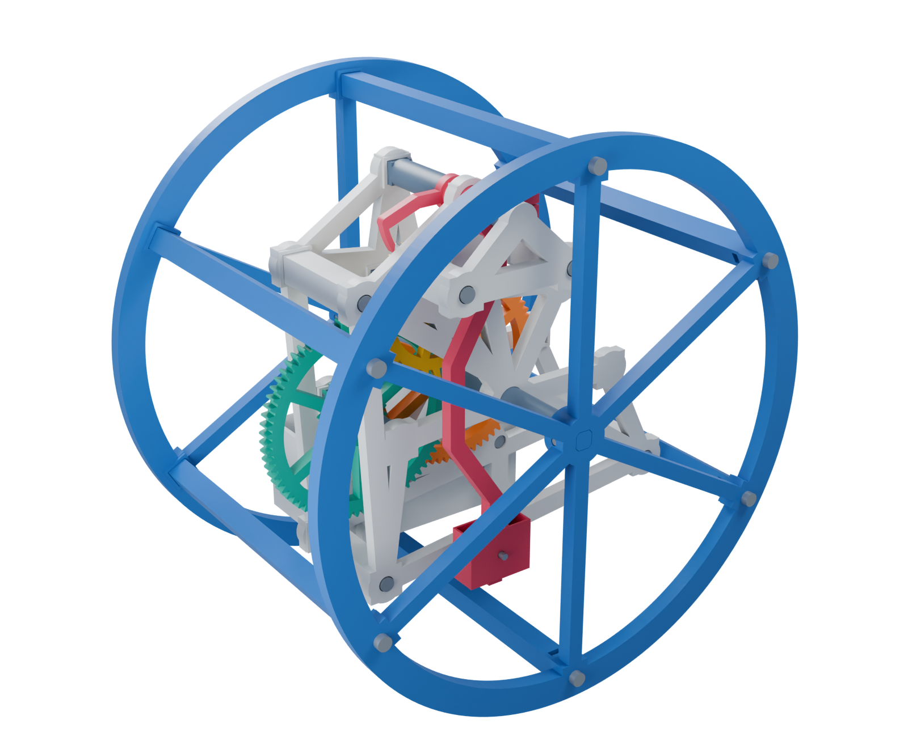

# R3 - bolted frames and three gear ratios

A new, **not yet physically tested** revision based on the first working lightweight clock and the observations recorded on 2 October 2026. The original build and its `v0.1.0` checkpoint remain unchanged.



## What changes

- Six square case posts and three square frame posts have flat ends, side-loading captive nuts and M3 clearance holes. Screws clamp the ends against flat seats; locating lips have **0.2 mm clearance per side**, so the posts do not spread the wheel rim.
- The bridge has two square posts, bolted at both ends. Its post locations are moved away from the pendulum clamp's swept envelope. The bridge supplies their square locating lips; their frame ends sit directly on a flat face.
- All three main-axle crosspins become **M3x16 screws and captive nuts**. The square axle still transmits torque; the screws retain it axially.
- The open bob has **1 mm outer walls**, a retained structural web, and an **M3x16 screw and captive nut** instead of a printed pin. Its screw passes through one of five 3.4 mm rod holes.
- The pendulum has its own wider front compartment and a bent rod that clears the main axle. The escapement is tilted inward by 10 degrees as a matched wheel/pallet arrangement to keep the pendulum clamp inside the rotating posts. Its working pallet profiles follow the first successful build.
- Both carrier frames support **16:1, 32:1 and 64:1**. Gear shafts are bolted to the rear frame and supported in clearance-fit blind seats in the front frame. The anchor pivot is supported by the rear frame and the bolted bridge. No bought bearings are needed.

The drum is **248 mm diameter x 180 mm between its outer plastic faces**, about **186.4 mm including the bounded screw heads**. Every individual part fits the 256 mm P1S volume. The wheel has a 13 mm radial rolling rim. The post body's furthest corner is 4.90 mm inside the rolling circle; the wider locating pads stay at least about 2.9 mm inside it. All post screws load the wheel axially.

## Files and printing

Start with [BUILD-GUIDE.pdf](BUILD-GUIDE.pdf), then use the exact quantities in [PRINT-LIST-16x.md](PRINT-LIST-16x.md). The other configurations have [32x](PRINT-LIST-32x.md) and [64x](PRINT-LIST-64x.md) lists. Do not print every file in every folder.

- `STL/common/`: shared case, frames, fastener posts, pivots, input gear, pendulum and bob.
- `STL/16x/`, `STL/32x/`, `STL/64x/`: the selected gear train and its spacers.
- `STL/slow-common/`: the reversed anchor shared by 32x and 64x.
- `STL/fit-tests/`: nut-post and locating-seat coupons.
- `assembly/`: positioned reference meshes, **not print files**.
- `source/`: editable Python CAD, geometric checks, render and guide generators.
- `layouts.json`: actual R3 shaft positions and per-ratio quantities. `escapement-reference.json` preserves the earlier tooth/pallet/contact-cycle data; its legacy layout centres are not the R3 frame layout.
- `renders/` and `r3-assembly.blend`: views of the actual mesh assemblies.

Use PLA, a 0.4 mm nozzle, 0.2 mm layers, and 100% scale. Small functional parts: 5-6 walls and solid or nearly solid sections. Larger frames and wheels: about 4-5 walls, 5 top/bottom layers and 25-35% infill as a starting point. The exported orientations put posts on a long flat side with their nut slots upward, gears on their broad faces, cups mouth-up, and journal sleeves upright. Keep gear teeth, journals and pallets free of support material. Preview the small transverse screw-hole bridges and nut recesses in the slicer.

The 248 mm wheel leaves only 4 mm on each side of a nominal 256 mm bed: **no outside brim**. Check your actual printer profile's exclusions and auxiliary structures. Tall journal sleeves and pivots can use a small brim.

### Fit coupons first

The final anti-rotation seats are **5.6 mm** wide throughout, selected by the builder after printing and trying the fit coupons. The side-loading insertion channels are **5.8 mm** wide, with a 2 mm taper into the seat, including the bob, square posts, pivot feet and axle-retaining hubs. Direct-entry hex pockets in the pendulum clamp and ballast bowl use the same 5.6 mm seats with a short 5.8 mm flared mouth. `NUT_WIDTH` and `NUT_ENTRY_WIDTH` in `source/build.py` control these dimensions independently.

To confirm the fit on another printer or with different nuts, print `40_nut_post_coupon_560.stl` and `41_post_seat_coupon.stl` in their supplied orientations, and try an actual nut and M3x10 screw. The nut should slide freely along the entry, then sit with its thread on the screw axis without rotating when tightened. The two flat faces must close without the locating lips spreading. The original 5.25 and 5.40 mm comparison coupons are retained at their labelled dimensions, all with the same 5.8 mm entry. If another seat width suits your nuts and printer, change `NUT_WIDTH` and regenerate; do not scale complete gear or frame files.

The hardware models use nominal 5.5 mm-across-flats nuts, leaving 0.1 mm total clearance across the production seat. The physical coupon test determines the printed fit; the complete R3 assembly still awaits a running trial. Tighten plastic joints only until seated; use the nut, not a self-tapped plastic thread.

## Hardware

| Configuration | M3x10 screws | M3x16 screws | Plain M3 nuts |
|---|---:|---:|---:|
| 16:1 | 15 | 17 | 32 |
| 32:1 | 16 | 17 | 33 |
| 64:1 | 16 | 17 | 33 |

These counts are within two dozen of each screw length and exclude optional fit-test hardware. Use plain nuts approximately 2.4 mm thick and screw heads no larger than 6.5 mm diameter x 3.2 mm high, with flat undersides. Screw length is measured under the head. No metal washers, threaded inserts or purchased bearings are required.

The gear pivot feet use one rear screw each; their front tips are located in blind seats, without clamping the rotating gear. The three main frame posts set the 48 mm face-to-face spacing. Spare bearing positions remain empty.

## Choosing a ratio

| Configuration | Gear pairs | Extra shaft | Anchor |
|---|---|---|---|
| 16:1 | 72:18 x 72:18 | None; B uses B16 position | Forward |
| 32:1 | 72:18 x 72:18 x 60:30 | Bslow and D positions | Reversed |
| 64:1 | 72:18 x 72:18 x 72:18 | Same Bslow and D positions | Same reversed anchor |

Both final pairs for the slower options have **90 teeth in total**, giving the same **56.25 mm centre distance**. To change 32x to 64x, swap only the D compound and the escape compound; all shafts, spacers, anchor and frames remain in place. Changing 16x to a slower option also relocates B, adds D and its spacers, and replaces the anchor and C rear spacer. Use the complete selected print list. Do not mix older revision parts into R3.

From the pendulum/front side, drive the orange input **counterclockwise**. The escape wheel turns counterclockwise in 16x and clockwise in 32x/64x. The extra external mesh requires the reversed anchor and escape wheel together.

At the original nominal pendulum period, one metre takes approximately **7 min 42 s / 15 min 25 s / 30 min 50 s** for 16x/32x/64x. These are calculated values, not measurements. The larger wheel, revised pendulum shape and metal bob fastener require calibration. The slower options reduce the ideal torque at the escapement by factors of two and four relative to 16x, so successful running on the same incline is not guaranteed.

## First trial

Begin with 16x. Bench-test with light hand torque before fitting the drum. Set the bob initially at the **150 mm hole** (fourth from the pivot), with about **15-20 g total iron**. Adjust the clamp angle for equal release on each half-swing, then snug its M3x16 screw. Leave the bearing stack free to turn with its designed endplay.

Start the rolling test with about **600 g** in the main bowl. The previous clock ran well with a 4 cm rise over an 80 cm board and also ran at 3 cm; at 2 cm it needed careful beat adjustment. Those correspond to approximately **2.9, 2.1 and 1.4 degrees**. Use the successful 4 cm setup as a starting point for R3, then reduce the slope once it runs steadily. Mark distance against a stopwatch rather than assuming the calculated rate. Lift the drum to reset it uphill.

A little periodic rocking can result from the pendulum exchanging angular momentum with the carrier and drum. The bolted joints address looseness; they are not intended to eliminate that coupled motion. Watch for missed or multiple releases, rubbing and changing beat rather than judging solely by the appearance of the rocking.

## What was checked

The three assembled configurations include worst-case screw-head envelopes and real nut envelopes. Checks cover each exported mesh, actual involute engagement, both escapement directions, nominal assembly interference, the full gear and carrier axial endplay, a 61-position pendulum sweep from -15 to +15 degrees, and 73 drum positions through a full rotation. Analytic radial bounds also cover every drum angle within the checked pendulum range.

Nominal axial gaps: **9.4 mm bob to front frame**, **6.2 mm bob-screw head to frame**, and **15.6 mm screw tip to front wheel spokes**. Overall clearance to the rotating case posts is at least **2.35 mm** within the checked range. The screw/nut stacks have full nominal nut engagement, with at least 0.4 mm of screw extending beyond the nut. Gear axial endplay is 0.6 mm; blind pivot seats leave 0.5 mm end clearance. At the combined endplay limits, the input hub still clears the large B wheel by 0.5 mm.

These checks do not simulate friction, extrusion errors, elastic deflection, creep, torque losses or running accuracy. R3 and all its ratio options need a physical trial. `checks-16x.json`, `checks-32x.json` and `checks-64x.json` contain the detailed results; [OBSERVATIONS.md](OBSERVATIONS.md) preserves the prior build's feedback.

## Regenerate

With Python 3.11+ and `source/requirements.txt` installed:

```sh
python source/validate.py
```

This regenerates all R3 meshes and runs the checks. It does not modify earlier designs. For illustrations, run `blender -b --factory-startup -t 6 --python source/render.py`. Rebuild the guide and print lists with `python source/make_guide.py` using ReportLab and Pillow. Create the complete archive and selected print kits with `python source/package.py --output /path/to/output-folder`. The checked-in outputs are ready to use without these tools.

Released under the [MIT License](LICENSE), as part of [lukacslacko/rolling_clock](https://github.com/lukacslacko/rolling_clock).
